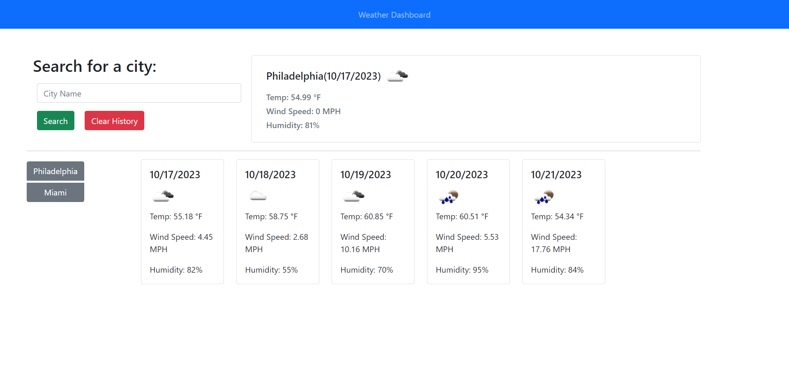

# Project Information

In this challenge, I created a Weather Dashboard that gives info on the weather of a
specific city when searched. It also provides a five day forecast of the weather for
that specific city. Search history is saved, and can be cleared.

## Acceptance Criteria

GIVEN a weather dashboard with form inputs
WHEN I search for a city
THEN I am presented with current and future conditions for that city and that city is added to the search history
WHEN I view current weather conditions for that city
THEN I am presented with the city name, the date, an icon representation of weather conditions, the temperature, the humidity, and the wind speed
WHEN I view future weather conditions for that city
THEN I am presented with a 5-day forecast that displays the date, an icon representation of weather conditions, the temperature, the wind speed, and the humidity
WHEN I click on a city in the search history
THEN I am again presented with current and future conditions for that city

### Live website and repo

https://github.com/TamirP123/weather-dashboard

https://tamirp123.github.io/weather-dashboard/

#### Photo of application
